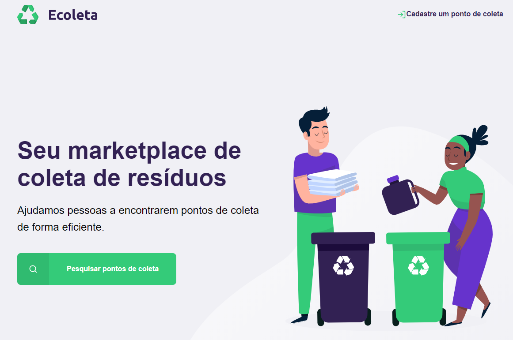

<h1 align="center"></h1>


<h4 align="center">
  🚀 NextLevelWeek 1.0
</h4>

<p align="center">
  <a href="#rocket-tecnologias">Tecnologias</a>&nbsp;&nbsp;&nbsp;|&nbsp;&nbsp;&nbsp;
  <a href="#instalação">Instalação</a>
</p>

<p align="center">
  
</p>


## ♻️ Tecnologias

Esse projeto foi desenvolvido com as seguintes tecnologias:

- [Node.js](https://nodejs.org/en/)
- [Nunjacks](https://www.npmjs.com/package/nunjucks)
- [SqLite3](https://www.npmjs.com/package/sqlite3)
- [Express](https://www.npmjs.com/package/express)


## Instalação
Instalar as dependências e iniciar o servidor:

```bash
npm install
npm start
```

Assim que o processo terminar, abra no seu navegador a página `localhost:3000` contendo o Projeto desenvolvido.

## Motivação
 - Se aprofundar mais no uso de CSS
 - Aprender a usar um banco de dados SQL com queries nativas
 - Aprender a usar o nunjacks e como ele facilita o HTML
